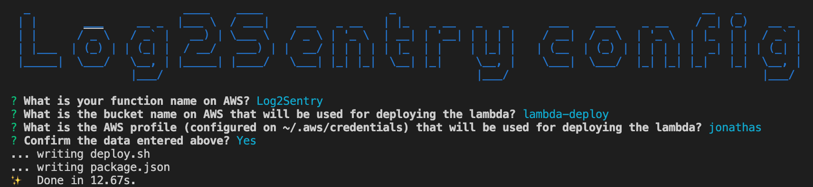

# Log2Sentry

Lambda for logging an Exception to Sentry.

If Sentry doesn't provide an SDK for your programming language or framework, you can capture the exception and send it to this lambda, which is able to forward it to Sentry.

## Dependencies

- [Docker](https://www.docker.com/)
- [yarn](https://yarnpkg.com/lang/en/)
- Node.js v10.15.3 (install using [nvm](https://github.com/nvm-sh/nvm))
- [AWS CLI](https://aws.amazon.com/cli/)
- [AWS SAM CLI](https://aws.amazon.com/serverless/sam/)

## Initial setup

Install the packages:

```bash
yarn
```

Run the wizard to configure the project according to your needs:

```bash
yarn setup
```



## Configuration on AWS

- Create your lambda on AWS and configure a POST endpoint pointing to it on API Gateway
- In "Environment variables" in the lambda configuration, add the SENTRY_DSN variable with your Sentry DSN as its value.
- Deploy your lambda by running: "yarn deploy"

## Usage

The payload you send must be in the following format:

```javascript
{
    "dsn": "your Sentry DSN here",
    "release": {
        "name": "myAppsReleaseName",
        "version": "1.0.0"
    },
    "environment": "production",
    "message": "This is my error",
    "level": "error",
    "user": {
        "id": "1234",
        "ip_address": "127.0.0.1",
        "email": "myemail@email.com",
        "username": "Keanu Reeves"
    },
    "tags": [
        { "name": "mytag01", "value": "1234" }
    ],
    "breadcrumbs": [
        {
            "level": "info",
            "category": "mycategory",
            "message": "In this part of the app, this is what happened",
            "data": {"this":"is a test"}
        }
    ]
}
```

Required attributes: release, environment, message, level.

- The dsn attribute is optional. If it's not informed, the payload is still valid. If it is informed, it will only be used if no SENTRY_DSN value is configured as enviornment variable in the lambda. The implementation was done this way so that the deployed lambda is used for only 1 project at a time and runtime costs are better controlled.
- Inside release should be your app's name and version, so Sentry issues can be associated with an app release.
- Inside environment, you can send production, staging or development, according to the environment where the app is running.
- Level (Sentry Severity) must be one of these: fatal, error, warning, log, info, debug, critical
- You can set any multiple key:value objects inside the tags array.
- You can set multiple [breadcrumbs](https://docs.sentry.io/enriching-error-data/breadcrumbs/?platform=javascript). A breadcrumb exists for tracking a trail of events which happened prior to an issue, so you can accumulate breadcrumbs somewhere as the user goes through your app's flow and only send them with the exception in case it happens, so you can track better what happened until then.

### Attention

Sentry groups issues by message, among other things. So if you keep the same message for the same kind of exception, your exceptions of the same kind will be inside the same issue there. If you add variable areas to the exception message (tite of the movie, for example), instead of having the same Sentry issue tracked for the same exception, a new issue will be created every time the same kind of exception occurs instead, leaving the interface polluted.

For example, in a lambda that handles credit cards, one of the exceptions is "DoNotHonor" coming from the payment gateway.
This created 5.1 thousand events for 2.4k users so far.

If instead the title was "DoNotHonor for user < emailhere >"
There would be 5.1 thousand rows instead of grouping all in 1 issue/row.
